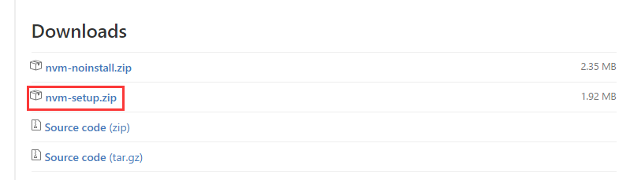

# 安装 nvm 和 Node.js

nvm 是 Node.js 的版本管理器，可以轻松的在Node.js的各个版本间来回切换。

## Unix 下安装

具体安装方法详见 [https://github.com/creationix/nvm](https://github.com/creationix/nvm)

### 1、通过脚本安装

curl命令
```bash
$ cd ~ && curl -o- https://raw.githubusercontent.com/creationix/nvm/master/install.sh | bash
```
wget命令
```bash
$ cd ~ && wget -qO- https://raw.githubusercontent.com/creationix/nvm/master/install.sh | bash
```

### 2、使用

列出所有本地的版本
```bash
$ nvm ls
```

列出所有主版本号为4的本地版本
```bash
$ nvm ls 4
```

列出所有远端的版本
```bash
$ nvm ls-remote
```

列出所有主版本号为4的远端版本
```bash
$ nvm ls-romote 4
```

显示主版本号为4的本地最新版本
```bash
$ nvm version 4
```

显示主版本号为4的远端最新版本
```bash
$ nvm version-remote 4
```

安装主版本号为4的最新版本
```bash
$ nvm install 4
```

设置4.4.4为系统版本
```bash
$ nvm alias default 4.4.4
```

### 3、更新 nvm 版本

```bash
cd "$NVM_DIR" && git pull origin master && git checkout `git describe --abbrev=0 --tags`
```

## Windows 下安装

Windows 下需要安装 [git](https://git-for-windows.github.io) 和 [python2.7](https://www.python.org/downloads/windows)

### 下载安装

1. 浏览器打开 [https://github.com/coreybutler/nvm-windows/releases](https://github.com/coreybutler/nvm-windows/releases)

2. 选择最新版本下载并解压安装



### 使用

列出所有本地的版本
```bash
$ nvm list
```

安装Node.js版本
```bash
$ nvm install 4.4.7
```

切换Node.js版本use
```bash
$ nvm use 4.4.7
```